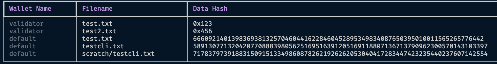
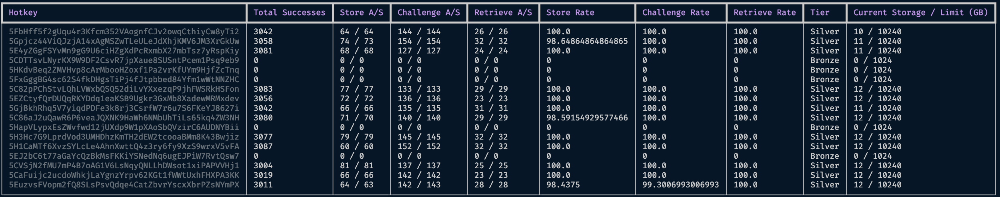
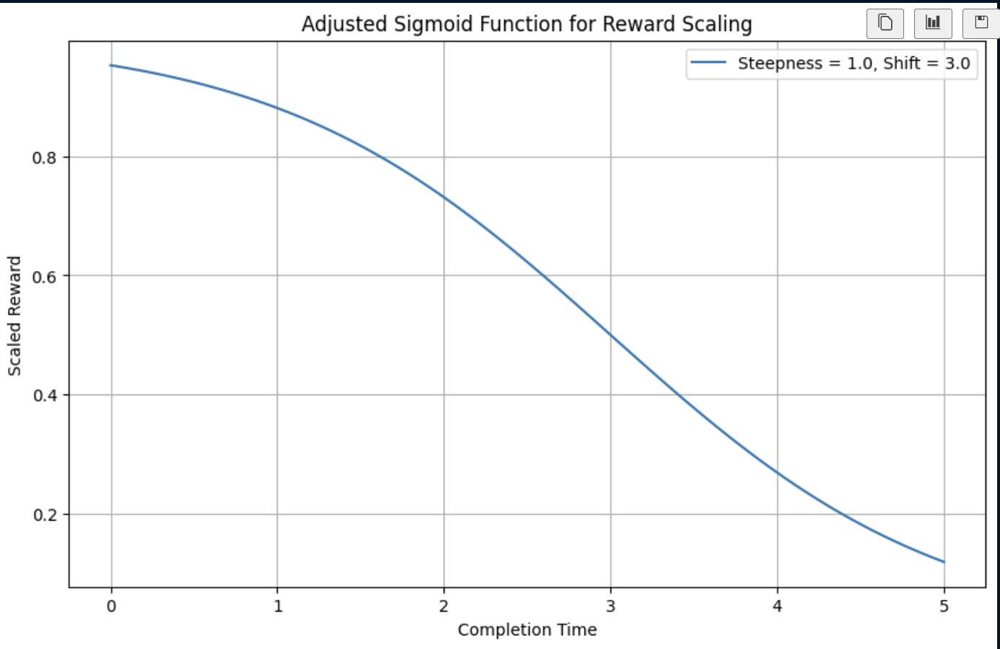

# FileTAO

[](https://pypi.org/project/filetao/)
[](https://pypi.org/project/filetao)
[](https://github.com/ifrit98/storage-subnet/blob/master/LICENSE)


FileTAO (Bittensor Subnet 21) implements a novel, multi-layered zero-knowledge interactive proof-of-spacetime algorithm by cleverly using Pedersen commitments, random challenges leveraging elliptic curve cryptography, sequential seed-based chained hash verification, and merkle proofs to achieve an efficient, robust, secure, and highly available decetralized storage system on the Bittensor network. The system validates on encrypted user data, such that miners are unaware of what data they are storing, and only end-users may encrypt/decrypt the data they provide with their bittensor wallet coldkey.

We consider this system to be an important stepping stone so that bittensor can fulfill its mission of democratizing intelligence, and a decentralized AWS platform is a key brick in this wall. 

**NOTICE**: Using this software, you **must** agree to the Terms and Agreements provided in the [terms and conditions](TERMS.md) document. By downloading and running this software, you implicitly agree to these terms and conditions.

Currently supporting `python>=3.9,<3.12`.

> Note: The storage subnet is in an alpha stage and is subject to rapid development.

# Table of Contents for Subnet 21 (FileTAO)
1. [FileTAO Overview](#filetao)
2. [Installation](#installation)
   - [Install Redis](#install-redis)
   - [Secure Redis Configuration](#secure-redis-configuration)
     - [Close external traffic to Redis](#close-external-traffic-to-redis)
     - [Automated Redis Password Configuration](#automated-redis-password-configuration)
     - [Enable persistence](#enable-persistence)
     - [Redis Troubleshooting](#redis-troubleshooting)
   - [Install PM2](#install-pm2)
3. [Storage API](#storage-api)
   - [Using API Wrappers](#using-api-wrappers)
   - [Using SubnetsAPI](#using-subnetsapi)
   - [API Storing Data](#api-storing-data)
   - [API Retrieving Data](#api-retrieving-data)
4. [Storage CLI Interface](#storage-cli-interface)
   - [Commands](#commands)
     - [Store: Storing Data on the Network](#store-storing-data-on-the-network)
     - [Retrieve: Retrieving Data from the Network](#retrieve-retrieving-data-from-the-network)
     - [Listing Stored Data](#listing-stored-data)
   - [Examples](#examples)
   - [Miner Statistics](#miner-statistics)
5. [What is a Decentralized Storage Network (DSN)?](#what-is-a-decentralized-storage-network-dsn)
   - [Role of a Miner (Prover)](#role-of-a-miner-prover)
   - [Role of a Validator (Verifier)](#role-of-a-validator-verifier)
6. [Main Features of Subnet 21](#main-features-of-subnet-21)
   - [Zero-Knowledge Proof of Space-Time System](#zero-knowledge-proof-of-space-time-system)
   - [Chained Proof Challenges](#chained-proof-challenges)
   - [Data Encryption and Zero-Knowledge Proofs for Privacy Preservation](#data-encryption-and-zero-knowledge-proofs-for-privacy-preservation)
   - [Scalability and Reliability](#scalability-and-reliability)
   - [Advanced Cryptographic Techniques](#advanced-cryptographic-techniques)
   - [User-Centric Approach](#user-centric-approach)
7. [Zero Knowledge Proof-of-Spacetime](#zero-knowledge-proof-of-spacetime)
   - [Storage Phase](#storage-phase)
   - [Challenge Phase](#challenge-phase)
   - [Retrieval Phase](#retrieval-phase)
8. [Reward System](#reward-system)
   - [Overview and Justification](#overview-and-justification)
   - [Speed and Reliability in Decentralized Storage Mining](#speed-and-reliability-in-decentralized-storage-mining)
   - [Viewing Wandb Runs](#viewing-wandb-runs)
9. [Epoch UID Selection](#epoch-uid-selection)
10. [Running FileTAO](#running-filetao)
    - [Running a Miner](#running-a-miner)
    - [Running a Validator](#running-a-validator)
    - [Running the API](#running-the-api)
    - [Setup WandB](#setup-wandb)
    - [Testnet](#testnet)
11. [Local Subtensor](#local-subtensor)
12. [Database Schema Migration](#database-schema-migration)
13. [Disable RDB](#disable-rdb)
14. [FileTAO Docker](#filetao-docker)
15. [Demos](#demo-notebooks-and-examples)

## Installation
```bash
# Please install torch-cpu if you do not need a gpu. (GPU not required for FileTAO)
pip install torch==2.3.0+cpu -f https://download.pytorch.org/whl/torch_stable.html

# Clone and Install the FileTAO repo.
git clone https://github.com/ifrit98/storage-subnet
cd storage-subnet
python -m pip install -e .
```

### Install Redis
Install Redis on your host system.

Linux [instructions](https://redis.io/docs/install/install-redis/install-redis-on-linux/)

```bash
sudo apt install lsb-release curl gpg

curl -fsSL https://packages.redis.io/gpg | sudo gpg --dearmor -o /usr/share/keyrings/redis-archive-keyring.gpg

echo "deb [signed-by=/usr/share/keyrings/redis-archive-keyring.gpg] https://packages.redis.io/deb $(lsb_release -cs) main" | sudo tee /etc/apt/sources.list.d/redis.list

sudo apt-get update
sudo apt-get install redis
```

Ensure the local Redis server is started.

```bash
sudo systemctl status redis-server.service
```

You should see output like:
```
● redis-server.service - Advanced key-value store
     Loaded: loaded (/lib/systemd/system/redis-server.service; disabled; vendor preset: enabled)
     Active: active (running) since Thu 2023-11-16 22:35:42 EST; 3min 25s ago
       Docs: http://redis.io/documentation,
             man:redis-server(1)
   Main PID: 31881 (redis-server)
     Status: "Ready to accept connections"
      Tasks: 5 (limit: 38370)
     Memory: 2.9M
        CPU: 387ms
     CGroup: /system.slice/redis-server.service
             └─31881 "/usr/bin/redis-server 127.0.0.1:6379" "" "" "" "" "" "" ""

Nov 16 22:35:42 user systemd[1]: Starting Advanced key-value store...
Nov 16 22:35:42 user systemd[1]: Started Advanced key-value store.
```

### Secure Redis Configuration

In order to securely run a node, whether a miner or validator, you must run ensure your redis instance is secure from the outside internet and is password-protected.

The following steps are **recommended** for secure communication on the network and data integrity:

1. Password protecting redis
1. Enabling redis persistence


#### Automated Redis Password Configuration
To enhance security, our system now automatically generates a strong password for Redis. This is **REQUIRED**. This is handled by the `set_redis_password.sh` script. Follow these steps to set up Redis with an automated password:

1. **Run the Redis Start Script**: 
    ```bash
    bash scripts/redis/set_redis_password.sh
    ```
    This script generates a secure password for Redis, attempts to shut down any running Redis instances, and then starts Redis with the new password.

2. **Set `REDIS_PASSWORD` Environment Variable**: 
    The script will export the `REDIS_PASSWORD` environment variable. Ensure this variable is set in your environment where the Redis client is running.

   To export your redis password generated in `set_redis_password.sh` as an environment variable at any time, run:
   ```bash
   REDIS_CONF="/etc/redis/redis.conf"
   export REDIS_PASSWORD=$(sudo grep -Po '^requirepass \K.*' $REDIS_CONF)
   ```

3. **Test password successfully enabled**
    Use the provided script `test_redis_require_pass.sh`
    ```bash
    bash ./scripts/redis/test_redis_require_pass.sh
    ```

#### Enable persistence
If persistence is not enabled in your redis instance, it is **CRUCIAL** that this feature is used. Provided script `./scripts/redis/enable_persistence.sh` does exactly this.

```bash
bash ./scripts/redis/enable_persistence.sh
```

You can verify that this was done correctly by running another provided script to test this feature was enabled.
```bash
bash ./scripts/redis/test_persistence.sh
```

> Note these scripts and operations REQUIRE sudo


#### Redis Troubleshooting
If you encounter issues with Redis, follow these steps:

1. **Check for Existing Redis Processes**: 
    Use `lsof` to look for processes using the default Redis port (6379).
    ```bash
    sudo lsof -i:6379
    ```
    If any processes are using this port, they will be listed.

2. **Terminate Unwanted Redis Processes**: 
    Find the PID under the `PID` column and terminate it using `kill`.
    ```bash
    kill -9 <PID>
    # Example: kill -9 961206
    ```

3. **Restart the Redis Service**: 
    If needed, restart the Redis service.
    ```bash
    systemctl restart redis
    ```

### Install PM2
This will allow you to use the process manager `pm2` for easily setting up your miner or validator.

Install nodejs and npm
```bash
sudo apt install nodejs npm
```

Once this completes, install pm2 globally
```bash
sudo npm install pm2 -g
```

## Storage API

There are three (3) main ways you can interact with the `FileTao` network to store and retrieve data. (4th coming soon through the website interface!):

1. API Wrappers (python) - this is the most convenient way for developers to interact
2. SubnetsAPI (lower-level python) - if you need more control over how you interface with FileTao
3. FileTao CLI (command-line) - most convenient for non-developers just wanting to store files using the cli

The following three sections will describe each of these in more detail.

### Using API Wrappers
There are two high-level wrapper functions that allow easy access to FileTao's storage mechanism through bittensor abstractions, `store` and `retrieve`.

It's as convenient as importing, preparing data, and firing away:
```python
import random
import bittensor as bt
from storage.api import store, retrieve

# Store data
wallet = bt.wallet()
subtensor = bt.subtensor()

data = b"Some bytestring data!"
cid, hotkeys = await store(data, wallet, subtensor, netuid=21)
print("Stored {} with {} hotkeys".format(cid, hotkeys))
> Stored bafkreid6mhmfptdpfvljyavss77zmo6b2oert2pula2gy4tosekupm4nqa with validator hotkeys [5CaFuijc2ucdoWhkjLaYgnzYrpv62KGt1fWWtUxhFHXPA3KK, 5FKwbwguHU1SVQiGot5YKSTQ6fWGVv2wRHFrWfwp9X9nWbyU]
```

Now you can retrieve the data using the content identifier `CID` and the `hotkey`s directly:
```python
data = await retrieve(cid, wallet, subtensor, netuid=21, hotkeys=hotkeys)
print(data)
> b"Some bytestring data!"
```

### Using SubnetsAPI 
In addition to the convenience wrappers and command-line interface, FileTao can be accessed via the bittensor subnets python API.

The subnets API requires two abstract functions to be implemented: `prepare_synapse`, and `process_responses`. This allows for all subnets to be queried through exposed axons, typically on the validator side.

To instantiate the API for any given request type (`store` or `retrieve`), you only need a bittensor `wallet`.
```python
# Import the API handler you wish to use
from storage import StoreUserAPI

# Load the wallet desired
wallet = bt.wallet(name="sn21", hotkey="query")

# Instantiate the API handler object
store = StoreUserAPI(wallet)
```

Here is a complete example to store data on `FileTao` programmatically.

```python
import bittensor as bt
from storage import StoreUserAPI

# Load the handler given desired wallet for querying
wallet = bt.wallet()
store = StoreUserAPI(wallet)

# Fetch the subnet 21 validator set via metagraph
metagraph = bt.metagraph(netuid=21)

# Store data on the decentralized network!
cid = await store(
   metagraph=metagraph,
   # add any arguments for the `StoreUser` synapse
   data=b"some data", # Any data (must be bytes) to store
   encrypt=True, # encrpyt the data using the bittensor wallet provided
   ttl=60 * 60 * 24 * 30,
   encoding="utf-8",
   uid=None, # query a specific validator UID if desired
)

print(cid)
> QmTPqcLhVnCtjoYuCZwPzfXcFrUviiPComTepHfEEaGf7g
```

> NOTE: Make sure you store the CID of your data, otherwise you will not be able to retrieve it!

### API Retrieving Data 
```python
from storage import RetrieveUserAPI

# Fetch the content-identifier for your data to retrieve
cid = "QmTPqcLhVnCtjoYuCZwPzfXcFrUviiPComTepHfEEaGf7g"

# Load the handler given desired wallet for querying
wallet = bt.wallet()

# Fetch the subnet 21 validator set via metagraph
metagraph = bt.metagraph(netuid=21)

# Instantiate the API with wallet
retrieve_handler = RetrieveUserAPI(wallet)

# Get the data back from the decentralized network!
data = await retrieve_handler(metagraph=metagraph, cid=cid)
print(data)
> b"\x12 K\x1b\x80\x9cr\xce\x0e\xf8\xd8\x15\x`"...
```

## Storage CLI Interface

The Storage CLI provides a user-friendly command-line interface for storing and retrieving data on the Bittensor network. It simplifies the process of data encryption, storage, and retrieval, ensuring security and ease of use. This tool is ideal for users who need to manage data securely on a decentralized network.

The FileTao storage cli uses IPFS content identifiers (`CIDs`) to identify storage on the network. This has several advantages over using simple hashes of the data, as a way of providing a more robust and verifiable way of identifying and retrieving data. 

Unlike simple hashes, which only represent the content, CIDs in IPFS (InterPlanetary File System) are more comprehensive. They contain not only a hash of the content but also information about the hashing algorithm and encoding used. This makes CIDs self-describing and ensures that the data retrieved is exactly what was stored, without any alterations.

The benefits of using CIDs in the FileTao Storage CLI on Bittensor include:

1. Content Addressing: CIDs allow for content-based addressing rather than location-based addressing. This means that the content itself, rather than its location on a specific server, is used to reference and access the data. This approach is inherently more secure and decentralized.
1. Version Control and Deduplication: Since CIDs change with even the slightest alteration in the content, they naturally support version control. Moreover, the use of CIDs facilitates deduplication, as the same content stored multiple times will have the same CID, saving space and reducing redundancy on the network.
1. Network Efficiency: Using CIDs improves network efficiency in data retrieval. Since the CID contains information about the content, it allows the network to fetch data from the nearest node that stores it, rather than relying on a central server, thus speeding up the data retrieval process.
1. Future-Proofing: The CID system is designed to be future-proof. As new hashing algorithms and encodings emerge, CIDs can adapt to include this new information without disrupting the existing system. This ensures long-term viability of the storage system on the Bittensor network.
1. Immutable and Tamper-Proof: The use of CIDs ensures immutability and tamper-proofing of data. Since the CID is a unique identifier for a specific version of the content, any changes in the content result in a different CID. This makes it easy to verify the integrity of the data and detect any unauthorized modifications.

CIDs can also be generated using the FileTao repo directly that have parity with IPFS out-of-the box. You can generate CIDv1 by calling `make_cid(data: Union[str,bytes])`

```python
from storage.validator.cid import make_cid

cid1 = make_cid("abc")
cid1
> CIDv1(version=1, codec=sha2-256, multihash=b'bafkreif2pall7dybz7v..')

from storage.validator.cid import decode_cid
# Decode a CIDv1 object to get the original data hash, produced by `sha256` (CIDv1)
decoded_hash = decode_cid(cid1)
decoded_hash
> b'\xbax\x16\xbf\x8f\x01\xcf\xeaAA@\xde]\xae"#\xb0\x03a\xa3\x96\x17z\x9c\xb4\x10\xffa\xf2\x00\x15\xad'

expected_hash = hashlib.sha256("abc".encode()).digest()
expected_hash
> b'\xbax\x16\xbf\x8f\x01\xcf\xeaAA@\xde]\xae"#\xb0\x03a\xa3\x96\x17z\x9c\xb4\x10\xffa\xf2\x00\x15\xad'

decoded_hash == expected_hash
> True
```

> Prerequisites: Before using the Storage CLI, ensure that Bittensor is installed and your wallet (hotkey and coldkey) is properly configured.


### Commands

#### 1. Store: Storing Data on the Network
This command encrypts and stores data on the Bittensor network.

##### Subcommands
- `put`: Encrypt and store data.

##### Usage
```bash
filetao store put --filepath <path-to-data> [options]
```

##### Options
- `--filepath <path-to-data>`: Path to the data file to be stored.
- `--hash_basepath <path>`: (Optional) Path to store the data hashes.
- `--stake_limit <float>`: (Optional) Stake limit to filter validator axons.
- `--wallet.name <name>`: (Optional) Wallet coldkey name.
- `--wallet.hotkey <name>`: (Optional) Hotkey name.

#### 2. Retrieve: Retrieving Data from the Network
This command retrieves previously stored data from the Bittensor network.

##### Subcommands
- `list`: Lists all data associated with a specific coldkey.
- `get`: Retrieve and decrypt data.

##### Usage
```bash
filetao retrieve get --data_hash <hash> [options]
```

##### Options
- `--data_hash <hash>`: Hash of the data to retrieve.
- `--hash_basepath <path>`: (Optional) Path where data hashes are stored.
- `--stake_limit <float>`: (Optional) Stake limit for validator axons.
- `--storage_basepath <path>`: (Optional) Path to store retrieved data.
- `--wallet.name <name>`: (Optional) Wallet coldkey name.
- `--wallet.hotkey <name>`: (Optional) Hotkey name.

#### Listing Stored Data
Lists all data hashes stored on the network associated with the specified coldkey.

##### Usage
```bash
filetao retrieve list [options]
```

##### Options
- `--hash_basepath <path>`: (Optional) Path where data hashes are stored.
- `--wallet.name <name>`: (Optional) Wallet coldkey name.

### Examples

#### Storing Data
```bash
filetao store put --filepath ./example.txt --wallet.name mywallet --wallet.hotkey myhotkey
```

#### Retrieving Data
```bash
filetao retrieve get --data_hash 123456789 --storage_basepath ./retrieved --wallet.name mywallet --wallet.hotkey myhotkey
```

#### Listing Data
```bash
filetao retrieve list --wallet.name mywallet
```




### Miner statistics

If you are running a validator and have a locally running instance of Redis, you may use this command to view the miner statistics gathered. This command will display a list of all hotkeys and their associated statistics, such as `total successes`, `attempts` vs `successes` for each category, `tier`, `current storage`, and `total storage limit`.

```bash
filetao miner stats --index 0
```


#### Options
- `--index <id>`: (Optional) Integer index of the Redis database (default: 0)


#### Notes
- Ensure your wallet is configured and accessible.
- File paths should be absolute or relative to your current directory.
- Data hashes are unique identifiers for your stored data on the Bittensor network.

For detailed instructions and more information, visit the [Bittensor Documentation](https://docs.bittensor.com).


## What is a Decentralized Storage Network (DSN)?
A DSN is a network architecture where data storage and management are distributed across various locations, controlled by multiple participants rather than a single entity. This approach enhances data security, availability, and resistance to censorship.

### Role of a Miner (Prover)
A miner in this context refers to a network participant responsible for storing and managing data. They prove the integrity and availability of the data they store through cryptographic methods, ensuring compliance with network protocols.

### Role of a Validator (Verifier)
A validator, on the other hand is a consumer of the proofs generated by the miner. They are responsible for maintaining an index of where data is stored and associated metadata for managing the system and maintaining data integrity and security.

## Main Features of Subnet 21

### Zero-Knowledge Proof of Space-Time System
- **Proof of Space-Time:** At its core, the application is built around a novel Zero-Knowledge Proof of Space-Time (ZK-PoST) algorithm. This algorithm allows validators to confirm that miners have consistently stored data over a period of time, offering a robust measure of data availability and integrity across the network.

### Chained Proof Challenges
- **Continuous Verification via Chained Challenges:** Validators issue sequential cryptographic challenges to miners. These challenges are linked or 'chained' together, ensuring that miners cannot predict future challenges and must consistently store the data to pass ongoing verifications.
- **Dynamic Challenge-Response Protocol:** This protocol is crucial for maintaining an ongoing verification system. Each challenge is dependent on the response to the previous one, forming a chain of trust and verification over time.

### Data Encryption and Zero-Knowledge Proofs for Privacy Preservation
- **Data Privacy Through Zero-Knowledge Proofs:** Validators verify the presence and integrity of data without accessing the actual content. This approach ensures data privacy, as miners are required to prove data storage without revealing the entire data itself.
- **Data Encryption:** All data is encrypted using bittensor wallet coldkey public/private key pairs, providing plug-n-play data storage for existing bittensor users.
- **Efficient and Secure Validation:** The system is designed to perform these verifications efficiently, minimizing computational overhead while maximizing security and privacy.

### Scalability and Reliability
- **Scalable Network Design:** The system is built to scale, capable of handling increasing storage demands and network growth without compromising performance.
- **High Data Availability and Fault Tolerance:** Data redundancy across multiple miners and continuous verification ensures high data availability and robustness against node failures.

### Advanced Cryptographic Techniques
- **Elliptic Curve Cryptography and Pedersen Commitments:** The application utilizes advanced cryptographic techniques, including ECC for efficient cryptographic operations, Pedersen Commitments for secure and private data commitments, and Merkle Trees for efficient proof of ownership verification.
- For more information see this detailed blog [post](https://medium.com/coinmonks/zero-knowledge-proofs-um-what-a092f0ee9f28).

### User-Centric Approach
- **Simplified User Experience:** Despite the underlying complexity, the system provides a straightforward interface for users to store and manage their data.
- **Assurance of Data Integrity and Availability:** Users can be confident in the integrity and availability of their data, backed by continuous cryptographic verification.

This ZK Proof of Space-Time system represents a significant advancement in decentralized storage, offering an efficient, secure, and private solution for data storage needs. It ensures that miners are honest and data is securely stored, while maintaining user privacy and system integrity.

## Zero Knowledge Proof-of-Spacetime

The algorithm comprises three phases:
- **Storage**: Miners store data locally and prove to the verifier (validator) that they have committed to the entire data block
- **Challenge**: Random challenges are issued by validators without advance warning, and miners must recommit to the entire data in order respond with the correct merkle proof.
- **Retrieval**: Upon retrieving data, miners are challenged to generate an efficient proof based on a random seed value that is sent back with the original data for verification.

### Storage Phase

In the Store phase, the goal is to securely store data and create a commitment to prove its storage without revealing the data itself. The mathematical steps are:

Validators query miners to store user data that is encrypted by the end-user coldkey pubkey. The encrypted data is sent to miners along with a random seed, which the miners use to initiate a sequential chain of seed + hash verification proofs. The previous seed value and the data is required for each subsequent commitment proof. The miner then applies a Pedersen committment to the entire data using the random seed, and forwards the proofs to the validator.

Upon receipt, validators verify the commitment and the initial hash chain, storing the associated metadata.


1. **Data Encryption**:
   - Data `D` is encrypted using a symmetric encryption scheme whos keys are .
   - Encrypted Data: `encrypted_D = encrypt(D, key)`.

2. **Hashing and Commitment**:
   - Hash the encoded data with a unique random seed to create a unique identifier for the data.
   - Data Hash: `data_hash = hash(encrypted_D + r_seed)`.
   - Create a cryptographic commitment using an Elliptic Curve Commitment Scheme (ECC), which involves a commitment function `commit` with curve points `g` and `h`.
   - Pedersen Commitment: `(c, m, r) = commit(encrypted_D + seed)`, where `c` is the commitment, `m` is the message (or commitment hash), and `r` is the randomness used in the commitment.
   - Chained Hash Proof: `m` is used as the initial `C_0`, which contains the initial random seed and the data itself. The random seed is stored for the next challenge in the chain.

3. **Storage**:
   - Store the data (`E`) and the random seed (`r_seed`) in local storage.


### Challenge Phase
In the Challenge phase, the system verifies the possession of the data without actually retrieving the data itself.

Validators request the miner prove that it currently stores the data claimed by issuing an index-based challenge, where the miner must apply Pedersen commitments to the entire data table given a random seed and a chunk size. 

Data is chunked according to the chunk size, and each slice is committed to using a Pederson commitment with the current random seed. Each commitment is appended to a merkle tree, and a subsequent proof is generated to obtain the path along the merkle tree such that a validator can verify the random seed was indeed used to commit to each data chunk at challenge time, thus proving the miner has the data at time of the challenge. 

The mathematical operations involved in the `Store`, `Challenge`, and `Retrieve` phases of this data storage and verification system can be broken down into a few key steps. Here's a simplified explanation for each phase:


1. **Chunking Data**:
   - The encrypted data is split into chunks: `chunks = chunk(encrypted_D, chunk_size)`.

2. **Selecting a Chunk for Challenge**:
   - A random chunk is selected for the challenge.
   - Selected Chunk: `chunk_j = chunks[j]`.

3. **Computing Commitment for the Chunk**:
   - A commitment is computed for the selected chunk.
   - Commitment for Chunk: `(c_j, m_j, r_j) = commit(chunk_j + seed)`.

4. **Creating a Merkle Tree**:
   - A Merkle tree is constructed using all chunk commitments.
   - Merkle Tree: `merkle_tree = MerkleTree([c_1, c_2, ..., c_n])`.

5. **Generating Merkle Proof**:
   - A Merkle proof is generated for the selected chunk to recreate the path along the merkle tree to the leaf that represents `chunk_j`.
   - Merkle Proof: `proof_j = merkle_tree.get_proof(j)`.

6. **Generating chained commitment**:
   - Compute commitment hash `Cn = hash( hash( encrypted_D + prev_seed ) + new_seed )`
   - Update previous seed `prev_seed = new_seed`

7. **Response**:
   - The challenge response includes the Pedersen elliptic curve commitment, the chained commitment hash, the Merkle proof, and the Merkle tree root.
   - The validator verifies the triple of proofs: chained commitment, elliptic-curve commitment, and the merkle proof.
 

### Retrieval Phase

In this phase, the data is retrieved, decrypted, and its integrity is verified.

1. **Fetching Encrypted Data**:
   - The encrypted data is fetched from the database based on its hash.
   - `encrypted_D = fetch(data_hash)`.

2. **Chained Verification Challenge**:
   - A new commitment is computed on the encrypted data with a new seed and the previous seed.
       - `Ch = hash( hash( encrypted_D + prev_seed ) + new_seed )`.

3. **Data Integrity Check**:
   - The retrieved data's integrity is verified by checking if the newly computed commitment matches the expected value.
   - `verify_chained(commitment, expected_commitment) == True`.

5. **Decryption**:
   - The data is decrypted using the symmetric encryption key and returned to the end-user.
   - Decrypted Data: `D = decrypt(encrypted_D, key)`.

In each phase, cryptographic primitives ensure data integrity and confidentiality. The encryption and commitment schemes ensure the data's security, while Merkle trees and random challenges provide a robust method for verifying data possession without revealing the actual data.

In each phase, cryptographic primitives like hashing, commitment schemes (e.g., Elliptic Curve Cryptography and Pedersen commitments), and data structures like Merkle trees are employed to ensure the integrity, confidentiality, and availability of the data. The use of seeds and randomness in commitments adds an additional layer of security and ensures that each instance of data storage and retrieval is unique and verifiable. See [here](https://kndrck.co/posts/efficient-merkletrees-zk-proofs/) for more information.


## Reward System

There are several components to the reward mechanism and is multi-layered. In a nutshell, the goals are as follows:

- Incentivize data durability and salience via cryptographic proof system. (E.g. don't lose data.)
- Incentivize good performance over a long period of time. (Tier system to reward based on reputation.)
- Incentivize fast response times. We want to retrieve user data quickly and ensure that it is over high network bandwidth.

In FileTAO's decentralized storage system, optimal behavior is crucial for the overall health and efficiency of the network. Miners play a vital role in maintaining this ecosystem, and their actions directly impact their rewards and standing within the subnet. We have implemented a tier-based reward system to encourage proper behavior, successful challenge completions, and consistent performance.

Failing to pass either challenge or retrieval verifications incur negative rewards. This is doubly destructive, as rolling statistics are continuously logged to periodically compute which tier a given miner hotkey belongs to. When a miner achieves the threshold for the next tier, the rewards that miner receives proportionally increase. Conversely, when a miner drops below the threshold of the previous tier, that miner's rewards are slashed such that they receive rewards proportionally to the immediately lower tier.

### Overview and Justification
FileTAO's Multi-dimensional reward mechanism is spread across 4 main axes:
(1) Availability: Is the miner reachable when requested? Incentivizes uptime.
(2) Speed (performant): how fast was the normalized response time?
(3) Correctness (reliable): did the proof succeed? y/n
(4) Trustworthiness (correctness over time): Tier definitions encapsulate consistenty and trustworthiness over time. A miner that rarely fails challenges and faithfully returns data when requested will receive an initial higher proportional reward.

The main drivers behind the reward mechanism are to model meritocratic systems as seen in the academic realm and in the business world that scales trust across time and observation of output. For example, we create various "tiers" in education, Undergraduate, Masters, PhD, Post Doc, or in software, Junior Engineer, Senior Engineer, Principal Engineer, Staff Engineer, etc where each subsequent level achieved has proportionally greater expecetations on performance and qualification of the individual. 

However, performance of the individual must match the expectations of the pedigree, and behavior that is inconsistent with a given level will be adjusted. If, for example, a Junior Engineer proves their output is substantial and over time completes projects that provide value, that engineer will be promoted to Senior Engineer over time, and pontentially beyond. Conversely, a Principal Engineer that consistently underperforms expectations will be demoted to a role with lower expectations until able to prove otherwise. The same logic applies to miners in FileTAO (SN21).

Tier (class) mobility is at the heart of the mechanism, and provides a balance between competition and trust, where over time competitiveness breeds a degree of trust on which we can associate a degree of reliability with a given entity (or miner).

**Why Optimal Behavior Matters:**
1. **Reliability:** Miners who consistently store, retrieve, and pass challenges with high Wilson Scores ensure the reliability and integrity of the network.
2. **Trust:** High-performing miners build trust in the network, attracting more users and increasing the overall value of the system.
3. **Efficiency:** Optimal behavior leads to a more efficient network, reducing the likelihood of data loss and ensuring fast, reliable access to stored information.

**Tier-Based Reward System:**
- **Tiers:** We classify miners into four tiers – Diamond, Gold, Silver, and Bronze – based on their performance metrics.
- **Performance Metrics:** These include the Wilson Score in storage, retrieval, and challenge tasks, as well as the total number of successful operations.
- **Higher Rewards for Higher Tiers:** Miners in higher tiers receive a greater proportion of the rewards, reflecting their superior performance and contribution to the network.

### **Wilson Score**

A measure of confidence is required to assess reliability in low sample environments. For miners who have less history, it is unfair to expect perfection early on and is account for by using a statistical tool, the `Wilson Score`. An asymmetric approximation of the confidence interval suited for low sample sizes given a particular z-score target, the `Wilson score` doesn't suffer from problems of overshoot and zero-width intervals that afflict the normal interval approximation.

See: https://en.wikipedia.org/wiki/Binomial_proportion_confidence_interval#Wilson_score_interval for more information.

For example, if a miner succeeds 4/5 times, it has a success rate of 80%. However it may not be indicative of true performance and reliability. Thus we have added Wilson Scores to accomodate low sample populations to get a more balanced approach to scoring miners.

This effectively allows for forgiveness for early failures and facilitates miners who are faithful actors to still rise through the tier system without being perpetually punished for early mistakes or poor optimization.

The equivalent wilson score for 4 of 5 attempts is `0.77`, which indicates with 95% statistical confidence that this miner is AT least this successful 80% of the time. Functionally, this allows for lowering of the tier requirements while having statistical confidence that over time, the miner may continue to improve performance from there while being considered reliable.

More concretely, given `N` trials, the wilson score establishes a lower bound for the confidence interval on miner success rates given low sample or population sizes. E.g., if a miner responds successfuly 8 of 9 times, it's lower bound on success rate is roughly `0.8701769999681506`. In other words, `wilson_score(8,9) == 0.8701769999681506`, suggesting that 87% of the time, this miner is expected to succeed on average. 

This calculation is used as the lower bound to determine tier eligibility and establishes a "minimium trust level" for the miner. If a miner continues to have failed challenges, the wilson score lower bound will cross below the current tier threshold, and when the tiers are recalculated, that miner will move down a tier (e.g. `Diamond -> Gold`.)

### **monitor**
Miners are also incentivized to be available, and are punshed for not being online, (e.g. failed `n` pings) by the `monitor` protocol. Periodically (every `m` steps) validators ping a set of `k` miners (default is 40), and after 5 successive failed attempts to ping a specific UID, that miner will be negatively rewarded for unavailability.

### Tier System:
The tier system classifies miners into five distinct categories, each with specific requirements and storage limits. These tiers are designed to reward miners based on their performance, reliability, and the total volume of data they can store.

Importance of Tier System:
- **Encourages High Performance:** Higher tiers reward miners with greater benefits, motivating them to maintain high Wilson Scores.
- **Enhances Network Reliability:** The tier system ensures that only the most reliable and efficient miners handle significant volumes of data, enhancing the overall reliability of the network.
- **Fair Reward Distribution:** The reward factors are proportional to the miners' tier, ensuring a fair distribution of rewards based on performance.

1. 🎇 **Super Saiyan Tier:** 
   - **Storage Limit:** 50 Petabytes (PB)
   - **Store Wilson Score:** 0.9
   - **Minimum Successes Required:** 15,000
   - **Reward Factor:** 1.0 (100% rewards)

2. 🌹 **Ruby Tier**
   - **Storage Limit:** 20 Petabytes (PB)
   - **Store Wilson Score:** 0.85
   - **Minimum Successes Required:** 10,000
   - **Rewrd Factor:** 0.9 (90% rewards)

3. 🔮 **Emerald Tier**
   - **Storage Limit:** 10 Petabytes (PB)
   - **Store Wilson Score:** 0.8
   - **Minimum Successes Required:** 8,000
   - **Rewrd Factor:** 0.85 (85% rewards)

4. 💠 **Diamond Tier:**
   - **Storage Limit:** 5 Petabytes (PB)
   - **Store Wilson Score:**  0.75
   - **Minimum Successes Required:** 6,000
   - **Reward Factor:** 0.8 (80% rewards)

5. 🔗 **Platinum Tier**
   - **Storage Limit:** 1 Petabyte (PB)
   - **Store Wilson Score:** 0.65
   - **Minimum Successes Required:** 4,000
   - **Reward Factor:** 0.75 (75% rewards) 

6. 🥇 **Gold Tier:**
   - **Storage Limit:** 200 Terabytes (TB)
   - **Store Wilson Score:** 0.65
   - **Minimum Successes Required:** 2,000
   - **Reward Factor:** 0.7 (70% rewards)

7. 🥈 **Silver Tier:**
   - **Storage Limit:** 50 Terabytes (TB)
   - **Store Wilson Score:** 0.6
   - **Minimum Successes Required:** 500
   - **Reward Factor:** 0.65 (65% rewards)

8. 🥉 **Bronze Tier:**
   - **Storage Limit:** 10 Terabytes (TB)
   - **Store Wilson Score:** Not specifically defined for this tier
   - **Minimum Successes Required:** Not specifically defined for this tier
   - **Reward Factor:** 0.6 (60% rewards)

#### Maintaining and Advancing Tiers:
- To advance to a higher tier, miners must consistently achieve the required minimum Wilson Scores in their operations.
- Periodic evaluations are conducted to ensure miners maintain the necessary performance standards to stay in their respective tiers, or move up or down tiers.
- Advancing to a higher tier takes time. In order to ascend to the first higher tier (Silver), it takes at least 1000 successful requests, whether they are challenge requests, store requests, or retry requests and must maintain the minimum Wilson Score for successes / attempts. 
- Depending on how often a miner is queried, how many validators are operating at one given time, and primarily the performance of the miner, this can take several hours to several days. Assuming full 64 validator slots are occupied, this should take ~100 hours.

As miners move up tiers, their responsibility increases proportionally. Thus, miners who move from Silver -> Gold are expected to be able to store up to 200 Terabytes (TB) of data, a 4x the storage cap for Silver. Similarly, it must maintain a minimum wilson score of 0.66 over it's lifetime, increasing the lower bound for expected performance and reliability. It also means that this miner will now receive a higher percentage of rewards for each successful query, going from 65% -> 70%. This does not mean that the miner may rest on its laurels, and may move right back down a tier (or more) if it does not meed the minimum requirements for Gold.

Assuming perfect performance, that out of ~200 miner UIDs, each of which is queried roughly 34 times every 1000 rounds, namely a 3.4% chance every query round, one can expect to reach the next tier within 
```bash
hours = total_successes / prob_of_query_per_round * time_per_round / 3600 / num_active_validators
hours = 4.9 # roughly 5 hours at perfect performance to next (Silver) tier (assuming no challenge failures)
```

#### Miner Advancement Program
The top two (2) performers per batch of `store`, `challenge` or `retrieve` requests will recieve a one-time tier appropriate boost. These tier-specific boosts decrease as you ascend the tier structure, and are defined in `constants.py`. For example:

```bash
TIER_BOOSTS = {
    b"Super Saiyan": 1.02, # 2%  -> 1.02
    b"Ruby": 1.04,         # 4%  -> 0.936
    b"Emerald": 1.05,      # 6%  -> 0.918
    b"Diamond": 1.08,      # 8%  -> 0.864
    b"Platinum": 1.1,      # 10% -> 0.825
    b"Gold": 1.12,         # 12% -> 0.784
    b"Silver": 1.16,       # 16% -> 0.754
    b"Bronze": 1.2,        # 20% -> 0.72
}
```

Concretely, a `Bronze` miner who is one of the top 2 within a batch of requests will receive a proportionally larger boost than a `Diamond` miner who is also in the top 2.

```
REWARD = TIER * REWARD * BOOST
Bronze  -> 0.72 = 0.6 * 1.0 * 1.2
Diamond -> 0.84 = 0.8 * 1.0 * 1.05
```

This mechanism *significantly* closes the gap for newer miners who perform well and should be able to ascend the tier structure honestly and faithfully. This is such that miners who consistently perform well but are lower tiers can more readily survive immunity period to make it to successively higher tiers and not "gate" access to the older miners. This directly negates the "grandfathering" effect. Higher tier miners that are in the top 2 are boosted significantly less than those Bronze or lower tier miners who make the top 2.


#### Periodic Statistics Rollover

Statistics for `store_successes/attempts`, `challenge_attempts/successes`, and `retrieve_attempts/successes` are reset every 2 epochs (720 blocks), while the `total_successes` are carried over for accurate tier computation. This "sliding window" of the previous 720 blocks of `N` successes vs `M` attempts effectively resets the `N / M` ratio and applies Wilson Scoring. This facilitates a less punishing tier calculation for early failures that would otherwise have to be "outpaced", while simultaneously discourages grandfathering older miners who were able to succeed early and cemented their status in a higher tier. The net effect is greater mobility across the tiers, keeping the network competitive while incentivizing reliability and consistency.

For example:
```bash
store_successes = 2
store_attempts = 2
challenge_successes = 3
challenge_attempts = 5
retrieve_successes = 1
retireve_attempts = 1
total_successes_epoch = 7
total_attempts_epoch = 9
total_successes = 6842
wilson_score = 0.79
```

The scores are then reset, while keeping the total successes for tier recognition:
```bash
store_attempts = 0
store_successes = 0
challenge_successes = 0
challenge_attempts = 0
retrieve_successes = 0
retrieve_attempts = 0
total_successes = 6851 # + 9 by aggregating total successs previous 2 epochs
```

> This miner would qualify for Diamond tier this round, as it has passed the minimum threshold for total successes (5000) and wilson score (0.77).

### Speed and Reliability in Decentralized Storage Mining

In the context of FileTAO's decentralized storage system, speed and reliability are critical factors that significantly influence the performance and reputation of miners. These factors not only affect the efficiency of data storage and retrieval but also play a crucial role in the overall user experience and the robustness of the network.

#### Importance of Speed:
1. **Quick Data Access:** Fast response times in data storage and retrieval operations are essential for a seamless user experience. Miners with quicker response times enhance the network's ability to serve data efficiently.
2. **Improved Network Performance:** Speedy processing of tasks contributes to the overall performance of the network, reducing bottlenecks and ensuring smooth data flow.
3. **Advantage in Reward Scaling:** The implemented reward scaling mechanisms favor faster response times. Miners who consistently provide quick services are likely to receive higher rewards due to better performance metrics.

#### Importance of Reliability:
1. **Data Integrity:** Reliable storage and retrieval ensure that data remains intact and accessible when needed. This is vital for maintaining the trust of users who rely on the network for data storage.
2. **Challenge Wilson Score:** A high Wilson Score in passing challenges signifies a miner's reliability. It shows their commitment to maintaining the network's integrity and their capability to meet the required standards.
3. **Tier Advancement and Stability:** Reliable miners have a better chance of advancing to higher tiers and maintaining their position. This stability is rewarded with increased earning potential and recognition within the network.

#### Reward Scaling Mechanism:
1. **Sigmoid Scaling:** The reward scaling is based on response times, using an adjustable sigmoid function across response times. This approach rewards faster and more reliable miners, aligning their incentives with the network's goals.

The sigmoid function is modified to incentivize faster response times while still sufficiently rewarding proper behavior. See the curve below:


2. **Tier-Based Reward Factors:** Each tier has an associated reward factor, which determines the proportion of rewards received by the miner. Higher tiers, achieved through consistent performance, offer greater rewards. Miner rewards and punishments are symmetrically scaled by their tier. Miners who have a lower tier are penalized proportionally less than miners who have a higher tier. This encourages top miners to have higher Wilson Scores, and allows for lower tier miners the ability to work their way up the ladder.

e.g.
```python
reward = 1.0 * TIER_FACTOR if task_successful else TASK_NEGATIVE_REWARD * TIER_FACTOR

# For Bronze and challenges
reward = 1.0 * 0.5 if challenge_successful else -0.05 * 0.5
reward
> 0.5 | -0.025 # lighter punishment for lower tier failure

# However for Gold
reward = 1.0 * 0.7 if challenge_successful else -0.05 * 0.7
reward
> 0.7 | -0.035 # harsher punishment for higher tier failure
```

The tier system in FileTAO's decentralized storage network plays a pivotal role in ensuring the network's efficiency and reliability. By setting clear performance benchmarks and rewarding miners accordingly, the system fosters a competitive yet fair environment. This encourages continuous improvement among miners, ultimately leading to a robust and trustworthy decentralized storage solution.

### Viewing Wandb Runs
You can view validator provided run data on wandb by viewing the project found at this [link](https://wandb.ai/philanthrope/philanthropic-thunder/table). This provides information on miner statistics and tier level available to the public.

## Epoch UID selection
Miners are chosen pseudorandomly using the current block hash as a random seed. This allows for public verification of which miners are selected for each challenge round (3 blocks).


For example:
```python
block_hash = get_block_hash(subtensor)
random.seed(block_hash)

miner_uids = get_query_miners(metagraph, k = 3)
miner_uids
>>> [0, 4, 9] # Only these miners are allowed to be challenged this round (3 blocks, ~36 sec)
```


## Running FileTao
FileTao is made up of both miners and validators, both of which are responsible for proper functioning of the network. Miners are the nodes that store and provide data availability, while validators are indexers and verifier nodes who challenge the miners to ensure the health and consistency of the network.


### Running a miner
You can run a miner in your base environment like so:

> NOTE: When registering a miner, it is *highly* recommended to not reuse hotkeys. Best practice is to always use a new hotkey when registering on SN21.

```bash
python neurons/miner.py --wallet.name <NAME> --wallet.hotkey <HOTKEY> --logging.debug
```

However, it is recommended to use a process manager, such as `pm2`. This can be done simply:

```bash
pm2 start <path-to-script> --interpreter <path-to-python-binary> --name <unique-name> -- <program-args..,>
```

For example running a miner:
```bash
pm2 start /home/user/storage-subnet/neurons/miner.py --interpreter /home/user/miniconda3/envs/sn21/bin/python --name miner -- --netuid 21 --wandb.off --wallet.name default --wallet.hotkey miner  --axon.port 8888 --logging.debug
```

> Make sure to use absolute paths when executing your pm2 command.


#### Data migration
If for whatever reason you need to migrate the data in your hard drive configured with `--database.directory` to a new directory than is reflected in the Redis index, then you can do it by simply running the script in `scripts/migrate_database_directory.sh`. 

When should you run the migration script?:
- if you want to specify a different --database.directory
- if your data has moved but your redis index has not reflected this change

**NOTE:** Please ensure you manually save a backup of the redis database.

Run:
```
# Enter the redis cli
redis-cli -a $REDIS_PASSWORD

# Run the save command manually and exit the redis session
SAVE
exit

# Make a backup of the dump
sudo cp /var/lib/redis/dump.rdb /var/lib/redis/dump.bak.rdb
```

It is wise to do this **before** running migration in case any unexpected issues arise.


```bash
bash scripts/migrate_database_directory.sh <OLD_PATH> <NEW_PATH> <DATABASE_INDEX>
```


Example usage from the top-level directory `storage-subnet`:

```bash
bash scripts/migrate_database_directory.sh ~/.data ~/.new_data_path 0 


Migrating database from ~/.data to ~/.new_data_path ...

2023-12-28 21:16:25.940 |       INFO       | Attempting miner data migration to /home/user/.new_data_path
2023-12-28 21:16:25.940 |       INFO       | Connecting to Redis at db=0...
2023-12-28 21:16:25.943 |     SUCCESS      | All data was migrated to the new directory.
```

> NOTE: If you are transferring data to a new server, you will need to modify the `rsync` command found in `scripts/migrate_database_directory.sh` to point to the new server.

E.g.
```bash
rsync -avz /path/to/source/file user@remote_host:/path/to/destination/
```

### Running a validator
```bash
python neurons/validator.py --wallet.name <NAME> --wallet.hotkey <HOTKEY>
```

> Note: If you are running a validator, you should also be running an API node. This increases resilience and allows greater volumes of data to be stored efficiently on the network.

A dummy wallet is automatically configured and used for all encryption on the network as a validator. The registered coldkey is not exposed. 

Run a validator using `pm2`:
```bash
pm2 start /home/user/storage-subnet/neurons/validator.py --interpreter /home/user/miniconda3/envs/sn21/bin/python --name validator -- --netuid 21 --logging.debug --wallet.name default --wallet.hotkey validator
```

> Note: It is imperative to specify the env var for the absolute path to `rebalance_deregistration.sh` script for rebalancing data appropriately on the network. This can be done by `.env` file or explicitly by exporting the path

For example,
```bash
REBALANCE_SCRIPT_PATH=/home/user/storage-subnet/scripts/rebalance_deregistration.sh
```

This way you are able to run your process from anywhere and not rely on relative path resolution to ensure proper functioning of the validator.


> Note: Challenge data lives by default for 5000 blocks in the validator index. This means after 7 days the data is removed and is no longer queried by the validator. This allows miners to recover who have lost challenge data

### Running the API

Running an API node at `neurons.api.py` allows you to create an entry node into the FileTao network for storing data. This can be connected to a back-end service, or used similarly to an IPFS node as an entrypoint for public use.

It is important to run an API to improve decentralization of the network and allow for a greater surface area of queryable nodes for end users.

This is similar to running a validator, however this exposes two axon endpoints to `store` and `retrieve` data using your registered validator hotkey on SN21. Miners cannot run an API node. You may gate access however you choose using the blacklist functions for each endpoint, and as a default all hotkeys are blacklisted except explicitly whitelisted ones in the `storage/validator/config.py` file. It is also possible to whitelist all hotkeys and allow data to be stored from any bittensor wallet, regardless of registration status by using the `--api.open_access` flag. 

It is **strongly** encouraged to carefully consider your use case and how you will expose this endpoint.

```bash
python neurons/api.py --wallet.name <NAME> --wallet.hotkey <HOTKEY>
```
> Note: this *must* be the same validator wallet used for running your validator. Miners cannot run an API node.

#### Options

- `--api.store_timeout`: The timeout (in seconds) for store data queries. This is the time allowed for a store operation before it times out. Default: 60 seconds.

- `--api.retrieve_timeout`: The timeout (in seconds) for retrieve data queries. This is the time allowed for a retrieve operation before it times out. Default: 60 seconds.

- `--api.ping_timeout`: The timeout (in seconds) for ping data queries. This is the time allowed for a ping operation before it times out. Useful for checking network latency and availability. Default: 2 seconds.

- `--api.whitelisted_hotkeys`: A list of whitelisted hotkeys. Only these hotkeys will be allowed to interact with the API. Default: [] (empty list, meaning no restrictions unless specified).

- `--api.open_access`: This flag completely whitelists all hotkeys and exposes the endpoint to the any hotkey, regardless of registration status. *USE WITH CAUTION*

These options are crucial for managing the behavior and security of your API interactions. The timeouts ensure that operations do not hang indefinitely, while the whitelisted hotkeys provide a mechanism to restrict access to trusted entities. Adjust these settings based on your operational requirements and security considerations.


### Setup WandB

Weights & Biases (WANDB) is a popular tool for tracking and visualizing machine learning experiments. To use it effectively, you need to log into your WANDB account and set your API key on your system. Here's a step-by-step guide on how to do this on Ubuntu:

#### Step 1: Installation of WANDB

Before logging in, make sure you have the WANDB Python package installed. If you haven't installed it yet, you can do so using pip:

```bash
# Should already be installed with storage repo
pip install wandb
```

#### Step 2: Obtain Your API Key

1. Log in to your Weights & Biases account through your web browser.
2. Go to your account settings, usually accessible from the top right corner under your profile.
3. Find the section labeled "API keys".
4. Copy your API key. It's a long string of characters unique to your account.

#### Step 3: Setting Up the API Key in Ubuntu

To configure your WANDB API key on your Ubuntu machine, follow these steps:

1. **Open Terminal**: You can do this by searching for 'Terminal' in your applications menu, or by using the keyboard shortcut `Ctrl + Alt + T`.

2. **Log into WANDB**: Run the following command in the terminal:

   ```bash
   wandb login
   ```

3. **Enter Your API Key**: When prompted, paste the API key you copied from your WANDB account settings. 

   - After pasting your API key, press `Enter`.
   - WANDB should display a message confirming that you are logged in.

4. **Verifying the Login**: To verify that the API key was set correctly, you can start a small test script in Python that uses WANDB. If everything is set up correctly, the script should run without any authentication errors.

5. **Setting API Key Environment Variable (Optional)**: If you prefer not to log in every time, you can set your API key as an environment variable in your `~/.bashrc` or `~/.bash_profile` file:

   ```bash
   echo 'export WANDB_API_KEY=your_api_key' >> ~/.bashrc
   source ~/.bashrc
   ```

   Replace `your_api_key` with the actual API key. This method automatically authenticates you with wandb every time you open a new terminal session.


#### Compute Requirements
No GPU is currently required to run either a validator or miner. This may change in the future for accelerating the proof and/or verification system.

See [`min_compute.yml`](min_compute.yml) for complete details on minimum and recommended requirements.


### Testnet
FileTao runs a testnet to deploy miners and try out miners on `netuid 22`. 

You can access this testnet by adding these to your script:
```
--subtensor.network test --netuid 22
```

### Local Subtensor

Availability is *critical* in storage in general and SN21, specifically. The reward mechanism punishes failed challenges and retrievals, even if the reason for that failure is unavailability, not only explicitly incorrect proofs or intentionally malicious behavior. It is possible to experience intermittent connectivity with the free provided endpoints for subtensor connections.

It is *highly* recommended that all miners and validators run their own local subtensor node. This will resolve the many issues commonly found with intermittent connectivity across all subnets.

To start your miner/validator using your local node, include the flag `--subtensor.network local` into your startup parameters.

Below are two methods to getting local subtensor up and running. Either use docker, or manually install on the hostmachine.

#### Docker installation
For easiest installation, run subtensor inside of the foundation-provided docker container.

For official docker and docker-compose install instructions, see [here](https://docs.docker.com/engine/install/ubuntu/#installation-methods) and [here](https://docs.docker.com/compose/install/linux/#install-using-the-repository), respectively.

```bash
# Install the docker compose plugin
sudo apt-get update
sudo apt-get install docker-compose-plugin

# Clone subtensor
git clone https://github.com/opentensor/subtensor
cd subtensor

# Start the subtensor container on port 9944
sudo docker compose up -d
```

#### Manual Installation
Provided are two scripts to build subtensor, and then to run it inside a pm2 process as a convenience. If you have more complicated needs, see the [subtensor](https://github.com/opentensor/subtensor/) repo for more details and understanding.
```bash
# Installs dependencies and builds the subtensor binary
./scripts/subtensor/build_subtensor_linux.sh

# Runs local subtensor in a pm2 process (NOTE: this can take several hours to sync chain history)
# Make sure the directory is configured properly to run from the built subtensor binary
# This lives in `./subtensor/target/release/node-subtensor`, so if your subtensor repo lives in
# ~/storage-subnet/subtensor (by default) then you would need to cd in, e.g.:
# cd ~/storage-subnet/subtensor

# Run the script to start subtensor
./scripts/subtensor/start_local_subtensor.sh
```

You should see output like this in your pm2 logs for the process at startup:

```bash
pm2 logs subtensor

1|subtenso | 2023-12-22 14:21:30 🔨 Initializing Genesis block/state (state: 0x4015…9643, header-hash: 0x2f05…6c03)    
1|subtenso | 2023-12-22 14:21:30 👴 Loading GRANDPA authority set from genesis on what appears to be first startup.    
1|subtenso | 2023-12-22 14:21:30 🏷  Local node identity is: 12D3KooWAXnooHcMSnMpML6ooVLzFwsmt5umFhCkmkxH88LvP5gm    
1|subtenso | 2023-12-22 14:21:30 💻 Operating system: linux    
1|subtenso | 2023-12-22 14:21:30 💻 CPU architecture: aarch64    
1|subtenso | 2023-12-22 14:21:30 💻 Target environment: gnu    
1|subtenso | 2023-12-22 14:21:30 💻 Memory: 62890MB    
1|subtenso | 2023-12-22 14:21:30 💻 Kernel: 5.15.0-1051-aws    
1|subtenso | 2023-12-22 14:21:30 💻 Linux distribution: Ubuntu 20.04.6 LTS    
1|subtenso | 2023-12-22 14:21:30 💻 Virtual machine: no    
1|subtenso | 2023-12-22 14:21:30 📦 Highest known block at #0    
1|subtenso | 2023-12-22 14:21:30 〽️ Prometheus exporter started at 127.0.0.1:9615    
1|subtenso | 2023-12-22 14:21:30 Running JSON-RPC HTTP server: addr=0.0.0.0:9933, allowed origins=["*"]    
1|subtenso | 2023-12-22 14:21:30 Running JSON-RPC WS server: addr=0.0.0.0:9944, allowed origins=["*"]    
1|subtenso | 2023-12-22 14:21:31 🔍 Discovered new external address for our node: /ip4/52.56.34.197/tcp/30333/ws/p2p/12D3KooWAXnooHcMSnMpML6ooVLzFwsmt5umFhCkmkxH88LvP5gm    

1|subtensor  | 2023-12-22 14:21:35 ⏩ Warping, Downloading state, 2.74 Mib (56 peers), best: #0 (0x2f05…6c03), finalized #0 (0x2f05…6c03), ⬇ 498.3kiB/s ⬆ 41.3kiB/s    
1|subtensor  | 2023-12-22 14:21:40 ⏩ Warping, Downloading state, 11.25 Mib (110 peers), best: #0 (0x2f05…6c03), finalized #0 (0x2f05…6c03), ⬇ 1.1MiB/s ⬆ 37.0kiB/s    
1|subtensor  | 2023-12-22 14:21:45 ⏩ Warping, Downloading state, 20.22 Mib (163 peers), best: #0 (0x2f05…6c03), finalized #0 (0x2f05…6c03), ⬇ 1.2MiB/s ⬆ 48.7kiB/s 
```

## Database Schema Migration

As over version `1.5.3` FileTao has a new miner database schema to work with the API. It is REQUIRED to update the schema for proper functioning of the FileTao network to participate. This tool will help you convert if you have data from <`1.5.3`.

Converts the schema of a Redis database to the new hotkey format. It automates the process of checking the environment for necessary configurations and performing the schema conversion on the specified Redis database, as well as cleanup after conversion (separate script).

This is done in two stages:
1. Conversion
2. Cleanup

Both scripts are labeled with the prefix `01` and `02` in order to distinguish the proper order to run.

## Backup
Please ensure you run the following to enter an authenticated session for redis:
```bash
redis-cli -a $REDIS_PASSWORD 
```

Then run save inside the session:

```bash
127.0.0.1:6379> SAVE
> OK

exit # exit the session to terminal
```

Finally, go to where the dump.rdb file is (`/var/lib/redis`` by default), and copy it as a backup **before** commencing the schema migration:

```bash
sudo cp /var/lib/redis/dump.rdb /var/lib/redis/dump.bak.rdb
```

> Shoutout to shr1ftyy for his step!

## Usage

Both scripts need to specify the Redis database connection details and the path to the Redis configuration file. The tool supports the following command-line arguments:

- `--redis_password`: Password for the Redis database (if applicable).
- `--redis_conf_path`: Path to the Redis configuration file. Default is `/etc/redis/redis.conf`.
- `--database_host`: Hostname of the Redis database. Default is `localhost`.
- `--database_port`: Port number of the Redis database. Default is `6379`.
- `--database_index`: Database index to use. Default is `0`.

### Script 1 Example

```bash
python scripts/redis/schema_migration/01_migrate.py --redis_password=mysecretpassword --database_host=localhost --database_port=6379 --database_index=0
```

This converts the current index to the new hotkey format.

### Script 2 Example

```bash
python scripts/redis/schema_migration/02_clean.py --redis_password=mysecretpassword --database_host=localhost --database_port=6379 --database_index=0
```
This cleans up any lingering old keys left after conversion.

#### Important Notes

- Ensure that the Redis database is accessible and that the provided credentials are correct.
- It's recommended to back up your Redis database before performing the schema conversion to prevent data loss.


## Disable RDB
Appendonly is sufficient for proper database persistence and RDB has introduced overhead that creates `closed connection` errors with `async` operations. Therefore we now recommend disabling this feature and have provided a convnenience script to do this.

Please run:
```bash
bash ./scripts/redis/disable_rdb.sh 
```

This will remove the `save` argument for RDB in the `etc/reids/redis.conf` file. 

Please ensure to path the path to your redis.conf file if it is differen from the default:
```bash
REDIS_PATH="/path/to/redis.conf"
bash ./scripts/redis/disable_rdb.sh $REDIS_PATH
```


## FileTAO Docker

FileTao is now able to run with docker with miner, validator, and api nodes. If running a validator, API nodes are *automatically* deployed in a separate container.

You are free to use this provided docker convenience but may still run nodes on bare-metal. However, it is recommended to upgrade to build and use these docker images, as they are generally more secure and convenient to use.

### Run filetao with docker

To run the suite of services (miner, validator, and redis), first run:

```sh
cp example.env .env
```

and populate the environment variables as appropriate. Ensure that each node has its own wallet, and is registered on SN21.

To run the entire stack, use the following commands:

```sh
docker-compose build
docker-compose up
```

To run only an individual service (e.g. miner and validator), use:

```
docker compose up --build {filetao-miner, filetao-validator}
```

### Demo notebooks and examples

See [`storage/api/demo_notebook.ipynb`]("docs/api_demo.ipynb") and [`storage/api/example.py`]("storage/api/example.py") To learn different ways to query the subnet.